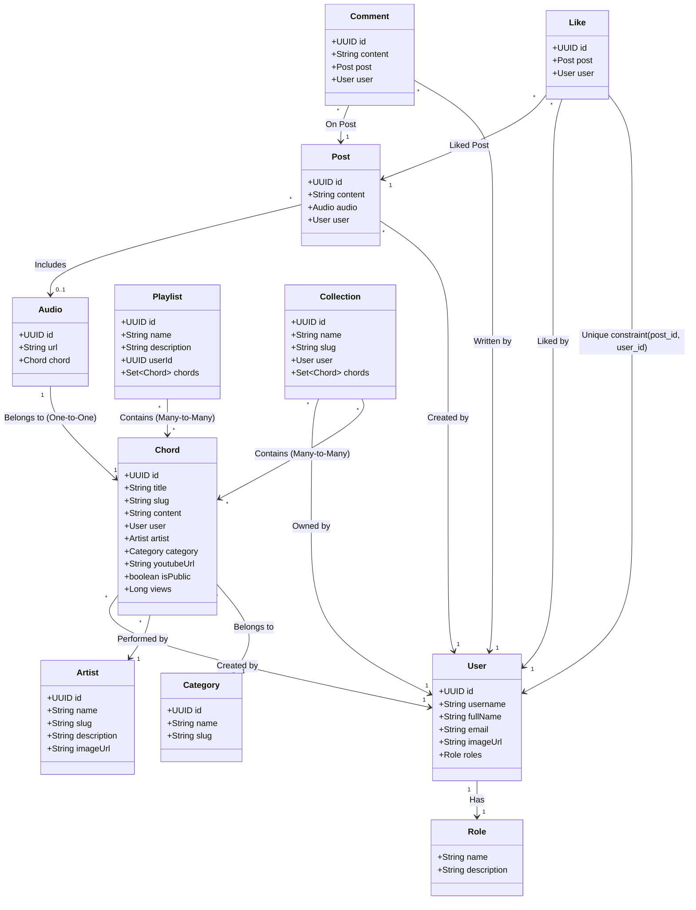

# Hướng Dẫn Tích Hợp API Cho Frontend (Frontend API Guide)

Tài liệu này cung cấp toàn bộ thông tin về các mối quan hệ thực thể (Entity Relationships), định dạng phản hồi chung (API Envelope), danh sách chi tiết các API endpoints, và hướng dẫn tích hợp chi tiết dành cho lập trình viên Frontend (FE).

---

## 1. Định Dạng Phản Hồi Chung (API Response Envelope)

Tất cả các API trả về từ Backend đều được chuẩn hóa qua lớp bao bọc `ApiResponse<T>` để đồng nhất cấu trúc dữ liệu. Dữ liệu thực tế sẽ nằm trong trường `result`.

### Định dạng JSON trả về:
```json
{
  "code": 200, // Mã HTTP Status hoặc mã lỗi tùy chỉnh (200 là thành công)
  "message": "success", // Thông điệp bổ sung (nếu có)
  "result": { ... } // Dữ liệu phản hồi chính (có thể là Object, Array, hoặc null)
}
```
*Lưu ý: Các trường có giá trị `null` sẽ tự động được loại bỏ khỏi JSON trả về.*

---

## 2. Sơ Đồ Mối Quan Hệ Giữa Các Thực Thể (Entity Relationships)

Dưới đây là sơ đồ Mermaid thể hiện mối quan hệ giữa các thực thể chính trong hệ thống:



### Mô tả quan hệ thực thể:
1. **User & Role (1 -- 1):** Mỗi người dùng có một vai trò bảo mật duy nhất (`USER`, `ADMIN`).
2. **User & Post (1 -- 0..*):** Một người dùng có thể tạo nhiều bài viết (`Post`).
3. **User & Chord (1 -- 0..*):** Một người dùng có thể đóng góp tạo nhiều hợp âm (`Chord`).
4. **Chord & Artist (0..* -- 1):** Mỗi hợp âm thuộc về một ca sĩ/nhạc sĩ (`Artist`).
5. **Chord & Category (0..* -- 1):** Mỗi hợp âm thuộc về một thể loại/danh mục (`Category`).
6. **Audio & Chord (1 -- 1):** Một file thu âm (`Audio`) liên kết trực tiếp với một hợp âm (`Chord`).
7. **Post & Audio (* -- 0..1):** Mỗi bài viết có thể đính kèm một file âm thanh (`Audio`) hoặc không.
8. **Post & User (* -- 1):** Mỗi bài viết thuộc về một người dùng viết nó.
9. **Comment & Post / User (* -- 1):** Một bình luận bắt buộc phải liên kết với một bài viết (`Post`) và người dùng (`User`).
10. **Like & Post / User (* -- 1):** Lượt thích liên kết giữa người dùng và bài viết. Hệ thống lưu cấu hình duy nhất trên cặp `(post_id, user_id)` để đảm bảo người dùng chỉ có thể thích bài viết một lần.
11. **Collection & User / Chords:** Mỗi bộ sưu tập hợp âm thuộc sở hữu của một `User` và chứa nhiều `Chords` thông qua bảng trung gian.
12. **Playlist & Chords:** Danh sách phát được lưu trữ bởi `userId` (dưới dạng ID thô) và chứa danh sách các `Chords`.

---

## 3. Danh Sách Các Endpoint APIs Chi Tiết

Tất cả các API ngoại trừ Authentication và Đăng ký người dùng đều yêu cầu truyền header `Authorization: Bearer <token>`.

### 3.1. Authentication (Xác thực)
*Base path: `/auth`*

| Method | Endpoint | Request Body | Mô tả |
| :--- | :--- | :--- | :--- |
| **POST** | `/auth/log-in` | `AuthenticationRequest` `{ username, password }` | Đăng nhập tài khoản thường, trả về Access Token. |
| **POST** | `/auth/log-in/google` | `{ "code": "AUTH_CODE_FROM_GOOGLE" }` | Đăng nhập thông qua Google OAuth2. |
| **POST** | `/auth/log-out` | `LogoutRequest` `{ token }` | Đăng xuất và đưa Access Token vào danh sách đen (blacklist). |
| **POST** | `/auth/introspect` | `IntrospectRequest` `{ token }` | Kiểm tra token còn hiệu lực hay không. |
| **POST** | `/auth/refresh` | `RefreshRequest` `{ token }` (hoặc gửi qua Cookie `refresh_token`) | Cấp mới Access Token bằng cách gửi Refresh Token. |

---

### 3.2. Users (Người dùng)
*Base path: `/users`*

| Method | Endpoint | Request Body / Params | Mô tả |
| :--- | :--- | :--- | :--- |
| **POST** | `/users` | `UserCreationRequest` `{ username, password, fullName, email }` | Đăng ký tài khoản người dùng mới (Public). |
| **GET** | `/users` | *Không* | Lấy danh sách toàn bộ người dùng (Yêu cầu quyền Admin). |
| **GET** | `/users/my-info` | *Không* | Lấy thông tin cá nhân của tài khoản đang đăng nhập (dựa trên JWT token gửi đi). |
| **GET** | `/users/{userId}` | *Path Variable: userId* | Lấy thông tin chi tiết người dùng theo ID. |
| **PUT** | `/users/{userId}` | `UserUpdateRequest` `{ password, fullName, imageUrl }` | Cập nhật thông tin cá nhân của người dùng. |
| **DELETE** | `/users/{userId}` | *Path Variable: userId* | Xóa tài khoản người dùng. |

---

### 3.3. Chords (Hợp âm)
*Base path: `/chords`*

| Method | Endpoint | Request Body / Params | Mô tả |
| :--- | :--- | :--- | :--- |
| **POST** | `/chords` | `ChordRequest` `{ title, content, artistName, categoryId, youtubeUrl, isPublic }` | Tạo mới một hợp âm. |
| **GET** | `/chords` | *Query Params:* `search`, `page` (default 0), `size` (default 10) | Tìm kiếm hợp âm theo tiêu đề và phân trang kết quả. |
| **GET** | `/chords/{id}` | *Path Variable: id* | Lấy chi tiết hợp âm bằng ID. |
| **PUT** | `/chords/{id}` | `ChordRequest` | Cập nhật nội dung hợp âm. |
| **DELETE** | `/chords/{id}` | *Path Variable: id* | Xóa hợp âm. |
| **GET** | `/chords/user/{userId}` | *Query Params:* `page`, `size` | Lấy danh sách hợp âm được tạo bởi người dùng cụ thể. |
| **GET** | `/chords/artist/{id}` | *Path Variable: artistId* | Lấy danh sách hợp âm theo ca sĩ. |
| **GET** | `/chords/audio/{audioId}` | *Path Variable: audioId* | Lấy hợp âm liên kết với Audio ID tương ứng. |
| **GET** | `/chords/related` | *Query Params:* `categoryName`, `currentChordId` | Gợi ý danh sách hợp âm liên quan cùng thể loại. |
| **GET** | `/chords/trending` | *Không* | Lấy danh sách hợp âm thịnh hành trong tuần qua. |
| **GET** | `/chords/mostViews` | *Không* | Lấy danh sách Top 10 hợp âm có lượt xem nhiều nhất. |
| **POST** | `/chords/{chordId}/view` | *Query Params:* `userId` (nếu đăng nhập) | Tăng lượt xem (view) cho hợp âm. |

---

### 3.4. Posts (Bài đăng cộng đồng)
*Base path: `/posts`*

| Method | Endpoint | Request Body / Params | Mô tả |
| :--- | :--- | :--- | :--- |
| **POST** | `/posts` | `PostRequest` `{ content, audioId, userId }` | Đăng bài viết mới, có thể đính kèm một File thu âm `audioId`. |
| **GET** | `/posts/{id}` | *Path Variable: id* | Lấy chi tiết bài đăng. |
| **PUT** | `/posts/{id}` | `PostRequest` | Cập nhật nội dung hoặc âm thanh đính kèm của bài viết. |
| **DELETE** | `/posts/{id}` | *Path Variable: id* | Xóa bài viết. |

---

### 3.5. Comments (Bình luận bài đăng)
*Base path: `/comments`*

| Method | Endpoint | Request Body / Params | Mô tả |
| :--- | :--- | :--- | :--- |
| **POST** | `/comments` | `CommentRequest` `{ content, postId, userId }` | Tạo bình luận mới cho bài đăng. |
| **GET** | `/comments/{id}` | *Path Variable: id* | Xem thông tin một bình luận. |
| **PUT** | `/comments/{id}` | `CommentRequest` `{ content }` | Sửa nội dung bình luận. |
| **DELETE** | `/comments/{id}` | *Path Variable: id* | Xóa bình luận. |
| **GET** | `/comments/post/{postId}` | *Path Variable: postId* | Lấy tất cả bình luận của bài viết (xếp mới nhất lên trước). |
| **GET** | `/comments/user/{userId}` | *Path Variable: userId* | Lấy danh sách bình luận của người dùng cụ thể. |
| **GET** | `/comments/post/{postId}/count` | *Path Variable: postId* | Đếm số lượng bình luận của một bài đăng. |

---

### 3.6. Likes (Lượt thích bài đăng)
*Base path: `/likes`*

| Method | Endpoint | Request Body / Params | Mô tả |
| :--- | :--- | :--- | :--- |
| **POST** | `/likes` | `LikeRequest` `{ postId, userId }` | Thích bài viết. Trả về mã lỗi nếu đã thích rồi. |
| **DELETE** | `/likes/post/{postId}/user/{userId}` | *Path Variables: postId, userId* | Bỏ thích (Unlike) bài viết. |
| **GET** | `/likes/post/{postId}` | *Path Variable: postId* | Lấy danh sách người dùng đã thích bài viết này. |
| **GET** | `/likes/user/{userId}` | *Path Variable: userId* | Lấy danh sách bài đăng mà người dùng đã thích. |
| **GET** | `/likes/post/{postId}/user/{userId}/check` | *Path Variables: postId, userId* | Kiểm tra nhanh xem người dùng đã thích bài đăng này chưa (trả về `true`/`false`). |
| **GET** | `/likes/post/{postId}/count` | *Path Variable: postId* | Lấy tổng số lượt thích của bài đăng. |

---

### 3.7. Playlists & Collections (Danh sách phát & Bộ sưu tập)
*Base paths: `/playlists`, `/collections`*

| Method | Endpoint | Request Body / Params | Mô tả |
| :--- | :--- | :--- | :--- |
| **POST** | `/playlists` | `PlaylistRequest` `{ name, description, userId }` | Tạo danh sách phát mới. |
| **GET** | `/playlists/{id}` | *Path Variable: id* | Lấy chi tiết danh sách phát kèm các hợp âm bên trong. |
| **GET** | `/playlists/user/{userId}` | *Path Variable: userId* | Lấy các danh sách phát của người dùng. |
| **POST** | `/playlists/{playlistId}/chords/{chordId}`| *Path Variables* | Thêm một hợp âm vào danh sách phát. |
| **DELETE**| `/playlists/{id}` | *Path Variable: id* | Xóa danh sách phát. |
| **POST** | `/collections` | `CollectionRequest` `{ name, userId, chordIds }` | Tạo bộ sưu tập hợp âm mới. |
| **GET** | `/collections/{id}` | *Path Variable: id* | Chi tiết bộ sưu tập. |
| **GET** | `/collections` | *Pageable Params* (`page`, `size`) | Lấy danh sách bộ sưu tập (Phân trang). |
| **PUT** | `/collections/{id}` | `CollectionRequest` | Cập nhật bộ sưu tập. |
| **DELETE**| `/collections/{id}` | *Path Variable: id* | Xóa bộ sưu tập. |

---

## 4. Hướng Dẫn Tích Hợp Tự Động Refresh Token Cho Frontend (Axios Interceptors)

Để giải quyết vấn đề **"khi Access Token hết hạn, người dùng bị văng ra trang Login mà không tự động làm mới token"**, Frontend cần cấu hình **Axios Interceptor**. 

Khi một API gửi đi nhận phản hồi lỗi `401 Unauthorized` từ server, FE sẽ dùng Refresh Token gửi lên API `/auth/refresh` để nhận Access Token mới, sau đó thử gửi lại yêu cầu API ban đầu một cách tự động và mượt mà.

### Code mẫu cấu hình Axios Client (JavaScript / TypeScript):

```javascript
import axios from 'axios';

// Tạo axios instance
const apiClient = axios.create({
  baseURL: 'http://localhost:8080', // Thay đổi tùy URL BE của bạn
  timeout: 10000,
  headers: {
    'Content-Type': 'application/json',
  },
  withCredentials: true, // Cho phép tự động gửi Cookie (đối với refresh_token lưu ở cookie)
});

// 1. Request Interceptor: Tự động đính kèm Access Token vào Header nếu có
apiClient.interceptors.request.use(
  (config) => {
    const accessToken = localStorage.getItem('access_token');
    if (accessToken) {
      config.headers['Authorization'] = `Bearer ${accessToken}`;
    }
    return config;
  },
  (error) => {
    return Promise.reject(error);
  }
);

// Biến kiểm soát trạng thái đang refresh để tránh gửi nhiều request trùng lặp
let isRefreshing = false;
let failedQueue = [];

const processQueue = (error, token = null) => {
  failedQueue.forEach((prom) => {
    if (error) {
      prom.reject(error);
    } else {
      prom.resolve(token);
    }
  });
  failedQueue = [];
};

// 2. Response Interceptor: Xử lý lỗi 401 (hết hạn Access Token) để Refresh
apiClient.interceptors.response.use(
  (response) => {
    return response.data; // Trả thẳng kết quả (đã bóc tách API Envelope)
  },
  async (error) => {
    const originalRequest = error.config;

    // Nếu lỗi 401 Unauthorized và chưa từng thử gửi lại request này
    if (error.response && error.response.status === 401 && !originalRequest._retry) {
      if (isRefreshing) {
        // Nếu đang trong quá trình refresh, đưa request hiện tại vào hàng đợi
        return new Promise((resolve, reject) => {
          failedQueue.push({ resolve, reject });
        })
          .then((token) => {
            originalRequest.headers['Authorization'] = `Bearer ${token}`;
            return apiClient(originalRequest);
          })
          .catch((err) => Promise.reject(err));
      }

      originalRequest._retry = true;
      isRefreshing = true;

      try {
        const storedToken = localStorage.getItem('access_token');
        
        // Gọi API Refresh Token
        // Ở đây BE chấp nhận token gửi qua Request Body hoặc Cookie
        const response = await axios.post('http://localhost:8080/auth/refresh', {
          token: storedToken // Hoặc lưu trữ/gửi refresh_token lấy từ localStorage tùy kiến trúc dự án
        }, {
          withCredentials: true
        });

        // Bóc tách API Envelope lấy kết quả trả về của BE
        const { token: newAccessToken } = response.data.result;

        // Lưu Access Token mới
        localStorage.setItem('access_token', newAccessToken);

        // Cập nhật lại Authorization Header của request bị lỗi ban đầu
        originalRequest.headers['Authorization'] = `Bearer ${newAccessToken}`;

        // Xử lý tất cả các request đang đợi trong hàng đợi
        processQueue(null, newAccessToken);

        // Gửi lại request ban đầu với token mới
        return apiClient(originalRequest);
      } catch (refreshError) {
        // Nếu refresh token cũng bị lỗi/hết hạn, buộc người dùng đăng nhập lại
        processQueue(refreshError, null);
        localStorage.removeItem('access_token');
        
        // Điều hướng về trang login (Ví dụ: React Router hoặc window.location)
        window.location.href = '/login';
        return Promise.reject(refreshError);
      } finally {
        isRefreshing = false;
      }
    }

    return Promise.reject(error.response ? error.response.data : error);
  }
);

export default apiClient;
```

### Cách sử dụng Axios Client ở Frontend:
```javascript
import apiClient from './apiClient';

// Gọi API lấy thông tin người dùng
apiClient.get('/users/my-info')
  .then(response => {
    // Dữ liệu đã được bóc tách từ envelope.result của Backend
    console.log('User profile:', response);
  })
  .catch(error => {
    console.error('Lỗi khi gọi API:', error.message);
  });
```
