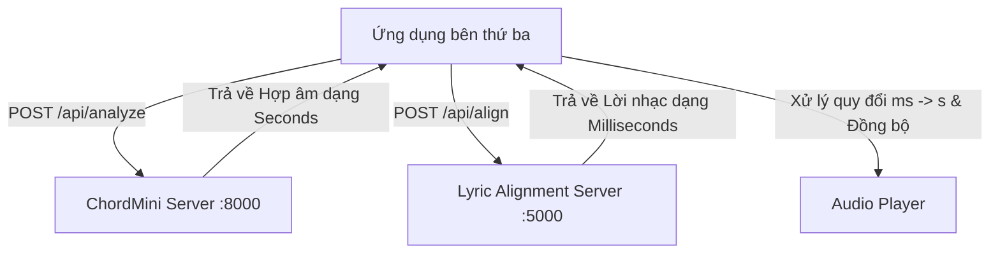

# Hướng dẫn Tích hợp Trực tiếp API ChordMini & Lyric Alignment (Chạy song song)

Tài liệu này mô tả chi tiết cách tích hợp trực tiếp 2 dịch vụ độc lập: **ChordMini (Nhận diện hợp âm - Cổng 8000)** và **Lyric Alignment (Căn chỉnh lời nhạc - Cổng 5000)** vào ứng dụng bên thứ ba. 

Trong kiến trúc này, ứng dụng của bạn sẽ gọi trực tiếp cả 2 API cùng một lúc và thực hiện đồng bộ, kết hợp dữ liệu ngay dưới Client (Frontend), giúp tối ưu hóa thời gian tải và giảm thiểu sự phụ thuộc giữa hai dịch vụ.

---

## 1. Sơ đồ Luồng Xử lý (Architecture Overview)

Ứng dụng của bạn sẽ gửi hai yêu cầu độc lập (có thể song song) đến hai dịch vụ:
1. Gửi file âm thanh sang **ChordMini Server (`:8000`)** để lấy mảng hợp âm (đơn vị: giây).
2. Gửi file âm thanh + lời bài hát sang **Lyric Alignment Server (`:5000`)** để lấy mảng Karaoke (đơn vị: mili-giây).
3. Client thực hiện quy đổi mili-giây sang giây cho lời nhạc, sau đó vẽ giao diện và đồng bộ với trình phát nhạc.



---

## 2. Chi tiết API 1: ChordMini (Nhận diện hợp âm)

* **URL**: `http://localhost:8000/api/analyze`
* **Phương thức (Method)**: `POST`
* **Kiểu dữ liệu (Content-Type)**: `multipart/form-data`

### **Tham số gửi đi (Request Parameters)**:
* `file`: Tệp âm thanh (`.mp3`, `.wav`, `.m4a`...).
* `model_type`: `"BTC"` hoặc `"ChordNet"`. (Không cần gửi tham số `lyric` vì ta phân tách gọi trực tiếp).

### **Cấu trúc JSON trả về (Response Schema)**:
*(Đơn vị thời gian là **Giây**)*
```json
{
  "filename": "song.mp3",
  "duration": 180.5,
  "model_used": "BTC",
  "chords": [
    { "start": 0.0, "end": 2.5, "chord": "C" },
    { "start": 2.5, "end": 5.2, "chord": "G" }
  ]
}
```

---

## 3. Chi tiết API 2: Lyric Alignment (Căn chỉnh lời nhạc)

* **URL**: `http://localhost:5000/api/align`
* **Phương thức (Method)**: `POST`
* **Kiểu dữ liệu (Content-Type)**: `multipart/form-data`

### **Tham số gửi đi (Request Parameters)**:
* `audio`: Tệp âm thanh (`.mp3`, `.wav`...).
* `lyric_type`: `"text"` (mỗi câu một dòng) hoặc `"json"`.
* `lyric`: Chuỗi ký tự chứa lời bài hát (mỗi dòng một câu).

### **Cấu trúc JSON trả về (Response Schema)**:
*(Lưu ý: Đơn vị thời gian mặc định là **Mili-giây**)*
```json
{
  "success": true,
  "alignment": [
    {
      "s": 1000, "e": 5500,
      "l": [
        { "d": "Endgame", "s": 1000, "e": 2200 },
        { "d": "chiến", "s": 2200, "e": 3500 },
        { "d": "thắng", "s": 3500, "e": 5500 }
      ]
    }
  ]
}
```

---

## 4. Mã nguồn Gọi song song (Javascript Promise.all)

Ứng dụng của bạn có thể gọi cả hai API song song để tiết kiệm thời gian xử lý:

```javascript
async function processSong(audioFile, lyricsText) {
    // 1. Chuẩn bị FormData cho ChordMini
    const chordForm = new FormData();
    chordForm.append('file', audioFile);
    chordForm.append('model_type', 'BTC');

    // 2. Chuẩn bị FormData cho Lyric Alignment
    const alignForm = new FormData();
    alignForm.append('audio', audioFile);
    alignForm.append('lyric_type', 'text');
    alignForm.append('lyric', lyricsText);

    try {
        // Gửi song song cả 2 yêu cầu đến 2 cổng khác nhau
        const [chordRes, alignRes] = await Promise.all([
            fetch('http://localhost:8000/api/analyze', { method: 'POST', body: chordForm }).then(r => r.json()),
            fetch('http://localhost:5000/api/align', { method: 'POST', body: alignForm }).then(r => r.json())
        ]);

        // 3. Quy đổi dữ liệu Lyric Alignment từ Mili-giây sang Giây
        let processedLyrics = null;
        if (alignRes.success) {
            processedLyrics = alignRes.alignment.map(line => ({
                s: line.s / 1000.0, // Đổi sang giây
                e: line.e / 1000.0, // Đổi sang giây
                l: line.l.map(word => ({
                    d: word.d,
                    s: word.s / 1000.0, // Đổi sang giây
                    e: word.e / 1000.0  // Đổi sang giây
                }))
            }));
        }

        return {
            chords: chordRes.chords,
            lyrics: processedLyrics,
            duration: chordRes.duration
        };

    } catch (error) {
        console.error("Lỗi trong quá trình gọi API song song:", error);
        throw error;
    }
}
```

---

## 5. Mã nguồn Giao diện Mẫu Tích hợp trực tiếp

Dưới đây là một tệp HTML tự chứa mẫu, giả định client đã gọi song song cả 2 API, tự quy đổi mili-giây sang giây và thực hiện render giao diện đệm nhạc:

```html
<!DOCTYPE html>
<html lang="vi">
<head>
    <meta charset="UTF-8">
    <title>Mẫu đồng bộ song song (Direct Client Integration)</title>
    <style>
        body { background: #0c0c0e; color: #e4e4e7; font-family: sans-serif; padding: 40px; }
        .lyrics-container { display: flex; flex-direction: column; gap: 16px; margin-bottom: 30px; }
        .line { font-size: 20px; color: #52525b; transition: all 0.3s; display: flex; gap: 8px; padding: 10px; border-left: 2px solid transparent; }
        .line.active { color: #ffffff; background: rgba(255,255,255,0.02); border-left-color: #8a4fff; border-radius: 0 8px 8px 0; }
        .word-box { display: flex; flex-direction: column; align-items: center; }
        .chord { font-size: 13px; color: #00f2fe; font-weight: bold; height: 18px; text-shadow: 0 0 6px rgba(0, 242, 254, 0.4); }
        .word { transition: color 0.2s; }
        .word.active { color: #8a4fff; text-shadow: 0 0 10px #8a4fff; font-weight: bold; transform: scale(1.05); }
    </style>
</head>
<body>

    <div class="lyrics-container" id="lyrics-viewport">
        <!-- Chords & Lyrics Karaoke sẽ hiển thị ở đây -->
    </div>

    <audio id="audio" src="mymusic.mp3" controls></audio>

    <script>
        // Dữ liệu mẫu nhận từ ChordMini (giây)
        const chordResponse = {
            "chords": [
                { "start": 0.0, "end": 1.0, "chord": "N" },
                { "start": 1.0, "end": 3.0, "chord": "C" },
                { "start": 3.0, "end": 6.0, "chord": "G" }
            ]
        };

        // Dữ liệu mẫu nhận từ Lyric Alignment (mili-giây)
        const alignResponse = {
            "success": true,
            "alignment": [
                {
                    "s": 1000, "e": 5500,
                    "l": [
                        { "d": "Endgame", "s": 1000, "e": 2200 },
                        { "d": "chiến", "s": 2200, "e": 3500 },
                        { "d": "thắng", "s": 3500, "e": 5500 }
                    ]
                }
            ]
        };

        // 1. CHUYỂN ĐỔI MILI-GIÂY SANG GIÂY
        const chordsList = chordResponse.chords;
        const lyricsData = alignResponse.alignment.map(line => ({
            s: line.s / 1000.0,
            e: line.e / 1000.0,
            l: line.l.map(w => ({
                d: w.d,
                s: w.s / 1000.0,
                e: w.e / 1000.0
            }))
        }));

        const viewport = document.getElementById('lyrics-viewport');
        const audio = document.getElementById('audio');

        // Hàm đối chiếu tìm hợp âm đang phát tại thời điểm cụ thể (giây)
        function findChord(time) {
            const found = chordsList.find(c => time >= c.start && time < c.end);
            return (found && found.chord !== 'N') ? found.chord : '';
        }

        // 2. RENDER CẤU TRÚC GIAO DIỆN
        lyricsData.forEach((line, lineIdx) => {
            const lineDiv = document.createElement('div');
            lineDiv.className = 'line';
            lineDiv.id = `line-${lineIdx}`;

            line.l.forEach((word, wordIdx) => {
                const wordBox = document.createElement('div');
                wordBox.className = 'word-box';

                // Đối chiếu tìm hợp âm tương ứng với thời điểm của từ
                const chordName = findChord(word.s);
                const chordSpan = document.createElement('span');
                chordSpan.className = 'chord';
                chordSpan.textContent = chordName;

                const wordSpan = document.createElement('span');
                wordSpan.className = 'word';
                wordSpan.id = `word-${lineIdx}-${wordIdx}`;
                wordSpan.textContent = word.d;

                wordBox.appendChild(chordSpan);
                wordBox.appendChild(wordSpan);
                lineDiv.appendChild(wordBox);
            });

            viewport.appendChild(lineDiv);
        });

        // 3. ĐỒNG BỘ THEO DÒNG THỜI GIAN NHẠC
        audio.addEventListener('timeupdate', () => {
            const time = audio.currentTime;

            lyricsData.forEach((line, lineIdx) => {
                const lineDiv = document.getElementById(`line-${lineIdx}`);
                
                // Đồng bộ dòng câu hát
                if (time >= line.s && time < line.e) {
                    lineDiv.classList.add('active');
                } else {
                    lineDiv.classList.remove('active');
                }

                // Đồng bộ từng từ đơn
                line.l.forEach((word, wordIdx) => {
                    const wordSpan = document.getElementById(`word-${lineIdx}-${wordIdx}`);
                    if (time >= word.s && time < word.e) {
                        wordSpan.classList.add('active');
                    } else {
                        wordSpan.classList.remove('active');
                    }
                });
            });
        });
    </script>
</body>
</html>
